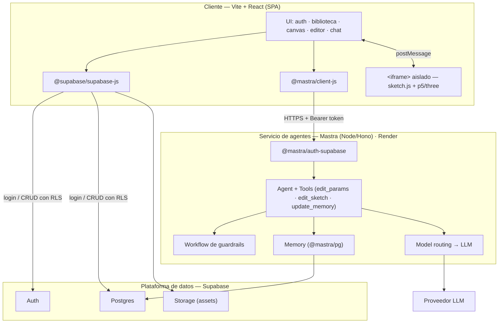
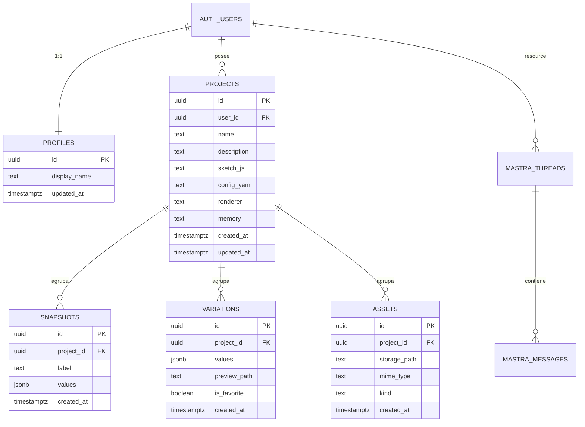

# CurateArtAI — Documentación técnica

## Índice

0. [Ficha del proyecto](#0-ficha-del-proyecto)
1. [Descripción general del producto](#1-descripción-general-del-producto)
2. [Arquitectura del sistema](#2-arquitectura-del-sistema)
3. [Modelo de datos](#3-modelo-de-datos)
4. [Especificación de la API](#4-especificación-de-la-api)
5. [Historias de usuario](#5-historias-de-usuario)
6. [Tickets de trabajo](#6-tickets-de-trabajo)
7. [Pull requests](#7-pull-requests)

---

## 0. Ficha del proyecto

### 0.1. Tu nombre completo

Javier Villarroel Freites (JVF).

### 0.2. Nombre del proyecto

CurateArtAI (en la interfaz: *sketch.explorer*).

### 0.3. Descripción breve del proyecto

Plataforma web que separa la capa de exploración de la capa de código: artistas exploran, editan y **curan** sketches generativos (p5.js / three.js) en lenguaje natural, asistidos por un agente de IA, con sus proyectos guardados en la nube.

### 0.4. URL del proyecto

Pendiente. El proyecto se desplegará en la entrega final.

### 0.5. URL del repositorio

Pendiente de rellenar con el fork de `AI4Devs-finalproject`.

---

## 1. Descripción general del producto

### 1.1. Objetivo

El arte generativo de código tiene dos capas hoy enredadas. La **capa de código** define el sistema (el algoritmo, sus reglas, su estética); la **capa de exploración** es la búsqueda de la pieza concreta dentro de ese sistema —mover un radio, cambiar una paleta— y la curación de las variaciones que valen la pena. Programar obliga a mezclarlas: para probar una variante hay que volver al editor, cambiar un número, recargar y mirar.

**CurateArtAI separa ambas capas.** Toma un sketch y lo convierte en una herramienta explorable y curable: expone sus parámetros como controles visuales, deja pedir cambios en lenguaje natural a un agente que edita el código, y permite guardar, comparar y curar las variaciones.

Resuelve tres problemas a la vez:

- **Quien no programa queda fuera:** un sketch es código, y sin saber editarlo no se puede tocar ni un color.
- **Quien programa pierde tiempo en lo repetitivo:** explorar variaciones es un bucle manual de editar-recargar-mirar.
- **No existe una capa de curación:** cuando una exploración da decenas de resultados, no hay forma cómoda de capturarlos, compararlos y quedarse con los mejores.

**Para quién:** artistas generativos, creative technologists, diseñadores, educadores y estudiantes que quieren explorar y curar variaciones de un sketch sin programar, o programando lo mínimo.

### 1.2. Características y funcionalidades principales

Agrupadas por área. El MVP del curso cubre un subconjunto; el resto marca la evolución del producto.

- **Cuentas y biblioteca:** registro/login con sesión persistente; biblioteca de proyectos en la nube (crear, abrir, guardar, borrar).
- **Exploración:** visor del sketch en iframe aislado; controles de parámetros generados automáticamente desde la configuración.
- **Agente de IA:** edición de configuración y código en lenguaje natural; generación de un sketch completo desde una descripción; historial de conversación por proyecto; memoria de proyecto que el agente lee y propone actualizar; editor de código y explorador de archivos como apoyo.
- **Curación:** snapshots de parámetros; (visión) generación por lotes de variaciones y grid de comparación con favoritas.
- **Producción y export (visión):** alta resolución, SVG para pen plotter, separación de capas para serigrafía.

### 1.3. Diseño y experiencia de usuario

El espacio de trabajo es de tema oscuro con paneles flotantes sobre un fondo de cuadrícula, apoyado en un sistema de diseño por tokens (ver §2). El flujo principal de extremo a extremo:

1. El usuario inicia sesión.
2. Crea un proyecto o abre uno de su biblioteca.
3. Ve el sketch y sus controles, generados desde la configuración.
4. Explora moviendo controles y/o pide un cambio al agente en lenguaje natural.
5. El agente modifica el código o los parámetros y devuelve el resultado.
6. La app aplica el cambio, recarga el sketch y guarda el proyecto.
7. Captura como snapshot las variaciones que quiere conservar.
8. Al volver, encuentra su proyecto, parámetros, snapshots e historial intactos.

> Capturas de pantalla y vídeo de la experiencia: pendientes para la entrega final.

### 1.4. Instrucciones de instalación

Pendiente. Se documentará en la entrega 2, cuando exista código ejecutable (front, backend y conexión a Supabase).

---

## 2. Arquitectura del sistema

**Stack tecnológico**

| Capa | Tecnología | Rol |
|---|---|---|
| Frontend | Vite + React 19 + TypeScript | Aplicación de página única (SPA) |
| | Tailwind CSS 4 | Estilos |
| | CodeMirror 6 | Editor de código (JS / YAML / JSON) |
| | `js-yaml` | Parseo de la configuración (YAML) |
| | `@supabase/supabase-js` | Autenticación y acceso a datos desde el cliente |
| | `@mastra/client-js` | Cliente del agente sobre la API REST de Mastra |
| Backend | Mastra (Node + Hono) | Servicio de agentes: Agents, Tools, Workflows, Memory |
| | `@mastra/pg` | Memoria conversacional en Postgres |
| | `@mastra/auth-supabase` | Verificación del token de sesión |
| Datos / Auth | Supabase | Postgres, Auth, Storage, RLS |
| Ejecución del arte | p5.js / three.js en `<iframe>` | Renderizado aislado del sketch |
| Infraestructura | Vercel/Cloudflare Pages · Render · Supabase | Frontend · backend · datos |
| Proceso | OpenSpec · ESLint · Vitest · Playwright | Especificación, lint y tests |

### 2.1. Diagrama de arquitectura

El sistema se apoya en servicios gestionados para construir rápido y centrarse en lo propio del producto —la exploración y curación de sketches— en vez de reinventar infraestructura. De ahí tres planos: **cliente**, **servicio de agentes** (Mastra) y **plataforma de datos** (Supabase). El sketch corre en un `<iframe>` aislado porque ejecuta código arbitrario y no debe poder tocar la app ni los datos del usuario.



**Patrón.** No es un monolito con API REST a medida, sino una composición de servicios gestionados: el cliente habla con Supabase (datos/auth) y con Mastra (agente) de forma independiente.

**Beneficios.** Menos código de infraestructura (auth, base de datos, memoria del agente y observabilidad vienen resueltos); secretos del LLM custodiados en el backend; el sketch aislado no compromete la app.

**Sacrificios / déficits.** Dependencia de servicios gestionados (acoplamiento a Supabase y Mastra); el backend en plan gratuito se suspende por inactividad y el primer acceso es lento; ejecutar código de sketch de terceros es una superficie de riesgo, mitigada con el `<iframe>` aislado; algunas funciones de exploración pueden depender de APIs solo disponibles en navegadores Chromium.

### 2.2. Descripción de componentes principales

| Componente | Responsabilidad | Tecnología |
|---|---|---|
| **Cliente** | UI, estado de pantalla, render del sketch, acceso a datos y llamadas al agente. | Vite + React + TypeScript |
| **Servicio de agentes** | Aloja el agente, sus tools y el workflow de guardrails; verifica el token y ejecuta la inferencia. | Mastra (Node/Hono) |
| **Plataforma de datos** | Identidad, persistencia (proyectos/snapshots/assets), memoria del agente y control de acceso por RLS. | Supabase |
| **iframe del sketch** | Ejecuta el código del sketch de forma aislada, comunicándose por el protocolo `postMessage`. | p5.js / three.js |

### 2.3. Descripción de alto nivel del proyecto y estructura de ficheros

A alto nivel, el proyecto se organiza en dos servicios desplegables por separado:

- **`front/`** — la SPA de React (UI, visor del sketch, controles, chat, editor).
- **`backend/`** — el servicio de agentes Mastra (Agent, tools, workflow, memoria).
- **Supabase** — proyecto gestionado (esquema, RLS, Storage), versionado con migraciones SQL.

> La estructura detallada de carpetas se concretará en la entrega 2, al materializar el código.

### 2.4. Infraestructura y despliegue

| Pieza | Plataforma |
|---|---|
| Frontend | Vercel o Cloudflare Pages (build estático de Vite) |
| Backend (Mastra) | Render |
| Datos / Auth / Storage | Supabase (Postgres gestionado) |

Cada servicio se despliega en su propia nube; no se usan contenedores propios. Los secretos (claves de LLM y `service_role`) viven solo en el backend; el cliente usa la `anon key` pública. El proceso de despliegue se detallará en la entrega final.

### 2.5. Seguridad

- **Aislamiento del sketch.** Corre en un `<iframe>` aislado; no puede acceder a la app, las claves ni los datos del usuario. La configuración se parsea, nunca se evalúa como código.
- **Secretos en el servidor.** Las claves del LLM y la `service_role` de Supabase residen solo en el backend. El cliente usa la `anon key` pública.
- **Control de acceso por capas.** Las tablas de aplicación se protegen con Row Level Security (un usuario solo accede a sus filas). Las tablas de memoria de Mastra se acceden solo desde el backend, que aísla por usuario tras verificar el token de sesión. (Detalle en §3.)

### 2.6. Tests

Plan de pruebas (se implementa en las entregas 2 y final):

- **Unitarios** (Vitest): parseo de `config.yaml`, generación de controles, validación de salida de las tools.
- **Integración**: CRUD con RLS, contrato del agente.
- **E2E** (Playwright): flujo principal login → crear → editar con el agente → persistir → recuperar.

---

## 3. Modelo de datos

La entidad central es el **proyecto**: un sketch con su código, configuración, parámetros e historial. Un usuario posee muchos proyectos; cada proyecto agrupa sus snapshots, variaciones y assets. Borrarlo arrastra todo lo suyo.

La persistencia se divide en dos grupos de tablas que conviven en la **misma base de datos de Supabase**: las **de aplicación** (las gestiona la app, se acceden desde el cliente con RLS) y las **de memoria de Mastra** (las gestiona Mastra, se acceden solo desde el backend).

### 3.1. Diagrama del modelo de datos



> `VARIATIONS` y el campo `kind` de `ASSETS` dan soporte a la visión de curación y producción; no forman parte del MVP del curso.

### 3.2. Descripción de entidades principales

Esquema en Postgres. El proyecto es el agregado raíz; `snapshots`, `variations` y `assets` se borran en cascada con él. El sketch se guarda como dos columnas de texto en `projects` (`config_yaml` y `sketch_js`), cuyo contenido sigue el contrato de §4.

```sql
-- Perfil 1:1 con el usuario de Supabase Auth.
create table profiles (
  id           uuid primary key references auth.users(id) on delete cascade,
  display_name text,
  updated_at   timestamptz not null default now()
);

-- Agregado raíz. Guarda código y configuración como texto.
create table projects (
  id             uuid primary key default gen_random_uuid(),
  user_id        uuid not null references auth.users(id) on delete cascade,
  name           text not null,
  description    text,
  sketch_js      text not null default '',
  config_yaml    text not null default '',
  renderer       text not null default 'p5js' check (renderer in ('p5js', 'threejs')),
  memory         text,
  created_at     timestamptz not null default now(),
  updated_at     timestamptz not null default now()
);
create index on projects (user_id);

-- Combinación de valores guardada y recuperable. values = { paramId: number|string }.
create table snapshots (
  id         uuid primary key default gen_random_uuid(),
  project_id uuid not null references projects(id) on delete cascade,
  label      text,
  values     jsonb not null,
  created_at timestamptz not null default now()
);
create index on snapshots (project_id);

-- Binarios del sketch y exports de producción en Supabase Storage.
create table assets (
  id           uuid primary key default gen_random_uuid(),
  project_id   uuid not null references projects(id) on delete cascade,
  storage_path text not null,
  mime_type    text,
  kind         text not null default 'asset' check (kind in ('asset', 'export')),
  created_at   timestamptz not null default now()
);
create index on assets (project_id);
```

**Memoria del agente.** El historial de chat lo gestiona Mastra (`@mastra/pg`) en el mismo Postgres de Supabase. Organiza la conversación en *resource* (el usuario), *thread* (el proyecto, un hilo por proyecto) y *message* (cada turno). Mastra crea esas tablas automáticamente.

**Seguridad (RLS).** Las tablas de aplicación tienen RLS activado: un usuario solo accede a filas con `user_id = auth.uid()`; `snapshots`, `variations` y `assets` heredan el acceso por su `project_id`. Las tablas de memoria de Mastra no pasan por RLS: las consulta el backend con privilegios elevados, aislando por `resourceId`/`threadId` tras verificar el token.

---

## 4. Especificación de la API

El agente se expone desde el backend Mastra mediante una **ruta custom** que encapsula el contrato específico de CurateArtAI: autenticación con token de Supabase, contexto completo del sketch, `threadId = projectId`, `resourceId = user.id`, ejecución del workflow de guardrails y respuesta estructurada lista para el frontend.

Mastra también publica rutas built-in como `POST /api/agents/{agentId}/generate`, pero el MVP usa `POST /agent` para mantener un contrato más simple entre el workspace y el backend.

```yaml
openapi: 3.0.0
info:
  title: CurateArtAI — API del agente (Mastra)
  version: 0.1.0
paths:
  /agent:
    post:
      summary: Envía una instrucción en lenguaje natural y devuelve los archivos del sketch modificados.
      security:
        - bearerAuth: []          # token de sesión de Supabase
      requestBody:
        required: true
        content:
          application/json:
            schema:
              type: object
              required: [projectId, message, sketchJs, configYaml, renderer]
              properties:
                projectId:        { type: string, format: uuid, description: "id del proyecto; también threadId del agente" }
                message:          { type: string, description: "instrucción del usuario" }
                sketchJs:         { type: string, description: "sketch.js actual completo" }
                configYaml:       { type: string, description: "config.yaml actual completo" }
                renderer:         { type: string, enum: [p5js, threejs] }
                previousResponse: { type: string, description: "respuesta anterior, opcional, para detectar repeticiones" }
      responses:
        '200':
          description: Respuesta del agente.
          content:
            application/json:
              schema:
                type: object
                required: [response]
                properties:
                  response:          { type: string, description: "texto para el usuario" }
                  appliedConfigYaml: { type: string, description: "config.yaml completo, si cambió" }
                  appliedSketchJs:   { type: string, description: "sketch.js completo, si cambió" }
                  memorySuggestion:  { type: string, description: "propuesta de nota de memoria" }
                  pendingQuestion:   { type: string, description: "si el agente necesita aclaración" }
        '401':
          description: Token de sesión ausente o inválido.
        '400':
          description: Body inválido o incompleto.
components:
  securitySchemes:
    bearerAuth:
      type: http
      scheme: bearer
```

Otros contratos del sistema, fuera de esta API REST:

- **Datos y auth (Supabase).** Acceso desde el cliente con `@supabase/supabase-js`, gobernado por RLS (no son endpoints propios; ver §3).
- **Protocolo `postMessage` (app ↔ iframe).** Salientes: `SKETCH_INIT`, `SKETCH_UPDATE`, `SKETCH_RESTART` con `{ config, values }`. Entrantes: `SKETCH_READY`, `SKETCH_ERROR { message }`.
- **Contrato del sketch.** `config.yaml` (describe canvas y parámetros: `range` → slider, `select` → selector) y `sketch.js` (lee los valores de `window.__SKETCH__.values`, escucha `postMessage`, emite `SKETCH_READY`/`SKETCH_ERROR`). El **renderer** se infiere del código (`THREE` → `threejs`; si no, `p5js`).

---

## 5. Historias de usuario

> Tres historias principales del MVP. El backlog completo incluye además: biblioteca de proyectos (H2), persistencia entre sesiones (H5), generar sketch desde descripción (H6), snapshots (H7) y la visión de curación/producción (variaciones por lotes, grid de favoritas, export a producción).

**Historia de Usuario 1 — Registro e inicio de sesión**
**Como** artista, **quiero** crear una cuenta e iniciar sesión, **para** tener mis proyectos asociados a mí y accesibles desde cualquier dispositivo.
**Criterios de aceptación:** registro con email/contraseña; sesión persistente entre recargas; las acciones con cuenta son inaccesibles sin sesión; los datos quedan aislados por usuario mediante RLS.

**Historia de Usuario 2 — Parámetros con controles visuales**
**Como** artista sin experiencia en código, **quiero** mover sliders y selectores, **para** explorar variaciones sin programar.
**Criterios de aceptación:** los controles se generan automáticamente desde `config.yaml`; mover un control actualiza el sketch en tiempo real; cambiar el canvas reinicia el sketch.

**Historia de Usuario 3 — Edición con el agente de IA**
**Como** usuario, **quiero** pedir cambios en lenguaje natural, **para** que el agente edite el sketch por mí.
**Criterios de aceptación:** la instrucción va al backend autenticado; el agente devuelve configuración o código validados; el cambio se aplica, el sketch se recarga y el proyecto se guarda; el historial se conserva por proyecto; ante fallo, mensaje claro sin pérdida de trabajo. Incluye la memoria de proyecto: el agente lee notas de contexto y puede proponer actualizarlas, sujetas a aprobación.

---

## 6. Tickets de trabajo

> Cuatro tickets representativos —base de datos, backend, visor frontend y conexión chat-agente—. El backlog completo está organizado en infraestructura, auth/datos, agente, frontend, curación/producción y calidad.

**Ticket 1 (Base de datos) — Esquema Supabase + RLS**
- **Historias:** H1, biblioteca y persistencia.
- **Descripción:** crear el proyecto Supabase y el esquema de datos de aplicación (`profiles`, `projects`, `snapshots`, `assets`) con políticas RLS por usuario.
- **Tareas:** escribir migraciones SQL versionadas (DDL de §3.2); activar RLS en todas las tablas; políticas con `auth.uid()`; herencia de acceso por `project_id`; índices por `user_id`/`project_id`; borrado en cascada.
- **Criterios de aceptación:** un usuario solo ve sus filas y el acceso cruzado queda bloqueado; borrar un proyecto arrastra sus snapshots y assets; las migraciones son reproducibles desde cero.

**Ticket 2 (Backend) — Agente Mastra con salida estructurada**
- **Historia:** H3 (edición con el agente).
- **Descripción:** agente que recibe una instrucción en lenguaje natural y devuelve `config.yaml`/`sketch.js` modificados, con salida estructurada, tools y guardrails.
- **Tareas:** definir el Agent y las tools `edit_params`, `edit_sketch`, `update_memory`; schema Zod de salida (`response`, `appliedConfigYaml?`, `appliedSketchJs?`, `memorySuggestion?`, `pendingQuestion?`); workflow de guardrails A/B/C; verificación del token Supabase en la ruta custom `POST /agent`; memoria con `@mastra/pg`.
- **Criterios de aceptación:** devuelve un objeto válido según el schema; cada tool valida su salida (YAML parseable / JS sin errores evidentes); los guardrails cortan bucles y fallos repetidos; una petición sin token válido devuelve 401; el historial se recupera al reabrir el proyecto.

**Ticket 3 (Frontend) — Visor del sketch**
- **Historia:** H3 (controles visuales) / render.
- **Descripción:** componente que monta el sketch en un `<iframe>` aislado, le inyecta los valores y gestiona la comunicación por `postMessage`.
- **Tareas:** iframe sandboxed con su HTML de arranque; inyección de `window.__SKETCH__` (config + valores); manejo de `SKETCH_READY`/`SKETCH_ERROR`; ciclo de vida de las blob URLs (crear/revocar); recarga al cambiar el canvas; actualización en tiempo real al mover un control.
- **Criterios de aceptación:** el sketch monta y renderiza; mover un control actualiza el sketch al instante; un error del sketch se muestra sin romper la app; no se filtran blob URLs entre recargas.

**Ticket 4 (Frontend + Agente) — Chat del workspace conectado al agente**
- **Historia:** H3 (edición con el agente).
- **Descripción:** conectar el panel de chat del workspace con `POST /agent` para enviar instrucciones en lenguaje natural, aplicar la respuesta estructurada del agente al sketch y persistir los cambios del proyecto.
- **Tareas:** crear `useAgent`; enviar `{ projectId, message, sketchJs, configYaml, renderer, previousResponse? }` con Bearer token; mantener historial local de la sesión; mostrar loading, errores y `pendingQuestion`; persistir `appliedSketchJs` en `projects.sketch_js` y `appliedConfigYaml` en `projects.config_yaml`; regenerar controles o recargar iframe según qué cambió; guardar `memorySuggestion` aprobado en `projects.memory`; actualizar `projects.updated_at`.
- **Criterios de aceptación:** el usuario puede pedir un cambio desde el chat y verlo reflejado en el sketch; una respuesta conversacional no recarga el iframe; una configuración inválida no se persiste; las sugerencias de memoria solo se guardan con aprobación explícita; errores de red/auth se muestran sin romper el workspace.

---

## 7. Pull requests

Pendiente. Se documentarán a medida que se abran (la entrega final pide 3).

- PR #1 — Entrega 1: documentación técnica.

## Lidr Creative Demo 26
demo creative code ai
